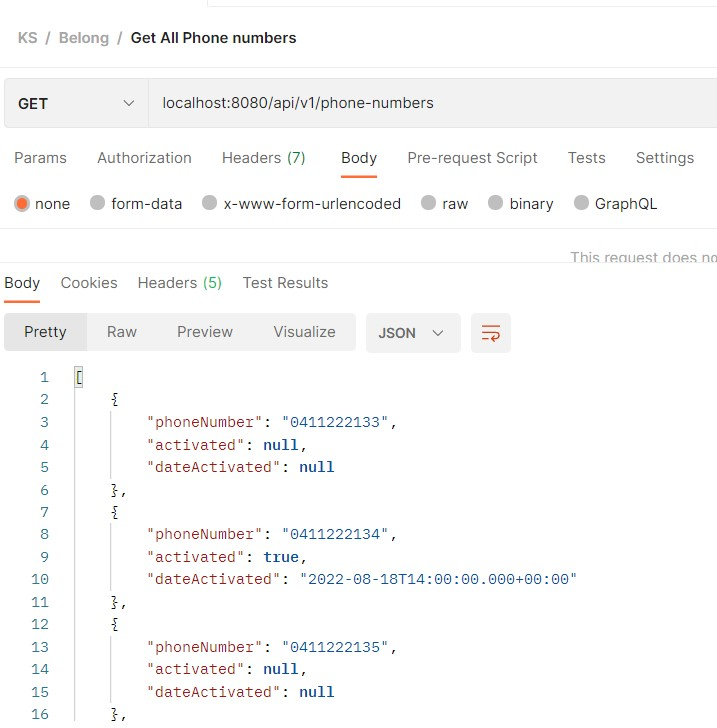
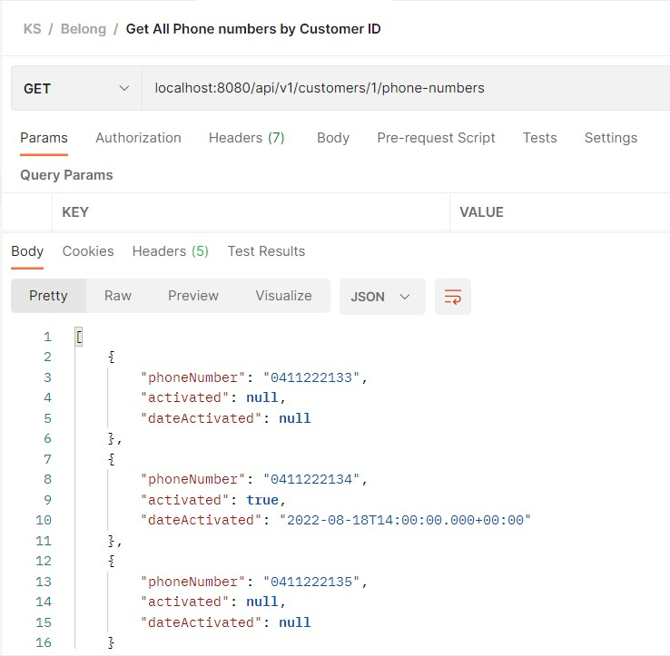
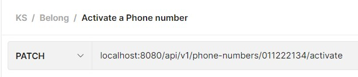
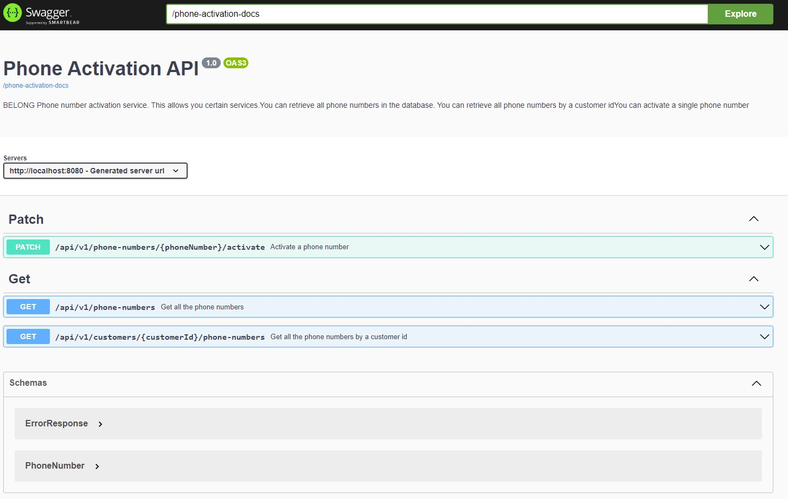
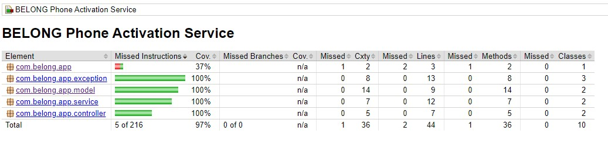
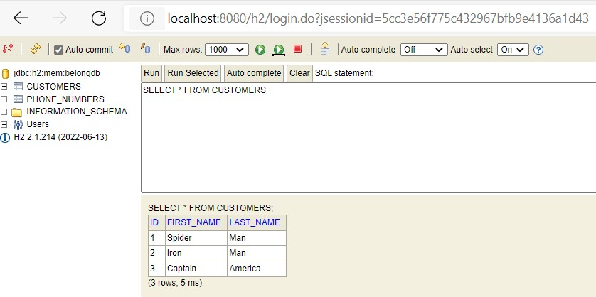
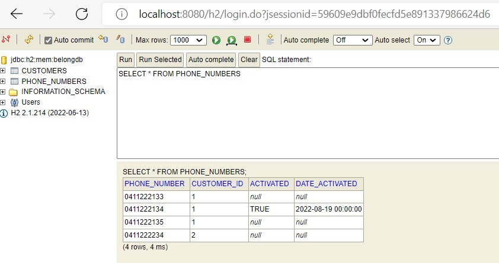

# Belong App
## The Phone Activation API

## Features

- Request all phone numbers in the database
- Request all the phone numbers for a Customer ID
- Request to activate a phone number

## Tech Details
Belong App is a Spring Boot Application
It uses following JDK, Maven version and some major Maven dependencies
- OpenJDK 18
- Maven 3.8.6
- Spring Boot 2.7.2
- SpringDoc OpenAPI 1.6.9
- JUnit 5.9.0
- Mockito 1.10.19
- H2 InMemory Database

This project uses Jacoco Maven plugin 0.8.8 to generate code coverage

## How to run this app locally using command line
- git clone git@github.com:iamkrunal/belong.git
- cd belong
- mvn clean install
- mvn spring-boot:run

The above sets of commands will start the application locally on port 8080

The following endpoints you can access

- Access all the phone numbers

  http://localhost:8080/api/v1/phone-numbers

  
   
- Access all the phone number for a customer

  http://localhost:8080/api/v1/customers/1/phone-numbers
  

 - Activate a phone number

   http://localhost:8080/api/v1/phone-numbers/011222134/activate

   

## Open API (Swagger UI) specifications

   http://localhost:8080/swagger-ui/index.html#/
   

## JaCoCo Unit test coverage
   
   
## Data in the H2 Database
   - Customer Table
   
   - Phone numbers Table
   